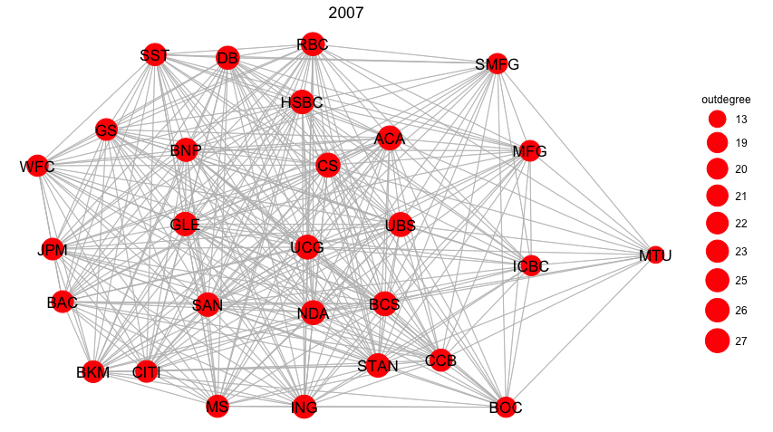
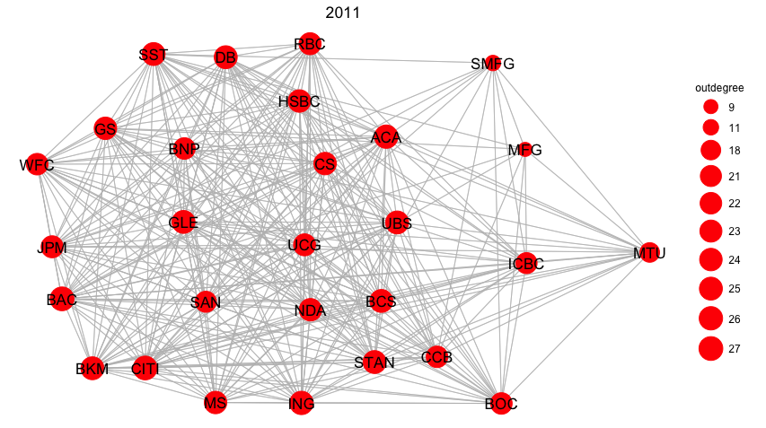
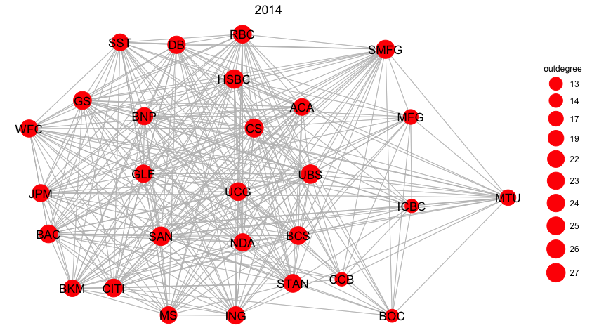

[](http://quantlet.de/)

## [](http://quantlet.de/) **FCOP_network_plots** [](http://quantlet.de/)

```yaml

Name of Quantlet : FCOP_network_plots

Published in : Factor_copula_systemic

Description : 'Construct a network plot from an adjacency matrix for a network of 28 systemically
important financial institutions (SIFIs). The plot is built using a force-directed
Fruchterman-Reingold graph drawing algorithm. The binary adjacency matrix is constructed via a
spacings-based approach applied to a Spearman rank correlation matrix'

Keywords : 'systemic risk, graph, fruchterman-reingold, correlation, correlation-matrix, risk, risk
measure, risk management, financial'

Author : Sergey Nasekin

Submitted : 2017/01/17

Datafile : 'adjmat1.csv, adjmat2.csv, adjmat3.csv, adjmat4.csv, adjmat5.csv, adjmat6.csv,
adjmat7.csv, adjmat8.csv'

Output : plots of the SIFI adjacency matrix-based network for years 2007-2014

Example : SIFI network plot for 2007, SIFI network plot for 2011, SIFI network plot for 2014

```








### R Code:
```r
rm(list = ls(all = TRUE))
graphics.off()
setwd("~/Documents/R")

# Load necessary packages
libraries = c("GGally","network","sna","ggplot2","scales")
lapply(libraries, function(x) if (!(x %in% installed.packages())) {
  install.packages(x)
})

lapply(libraries, library, quietly = TRUE, character.only = TRUE)

# Load adjacency matrices
adjmat1 = read.table('adjmat1.csv',sep=',')
adjmat2 = read.table('adjmat2.csv',sep=',')
adjmat3 = read.table('adjmat3.csv',sep=',')
adjmat4 = read.table('adjmat4.csv',sep=',')
adjmat5 = read.table('adjmat5.csv',sep=',')
adjmat6 = read.table('adjmat6.csv',sep=',')
adjmat7 = read.table('adjmat7.csv',sep=',')
adjmat8 = read.table('adjmat8.csv',sep=',')

# Number of nodes in the network
m      = nrow(adjmat1)

# Initialize the network
ntwrk  = network.initialize(m)    #Initialize the network
network.adjacency(adjmat1,ntwrk)      #Import the edge data
coords = gplot.layout.fruchtermanreingold(ntwrk, NULL)
x_std  = (coords[, 1]-min(coords[, 1]))/(max(coords[, 1])-min(coords[, 1]))
y_std  = (coords[, 2]-min(coords[, 2]))/(max(coords[, 2])-min(coords[, 2]))

# Fix the coordinates
ntwrk %v% "x" = x_std
ntwrk %v% "y" = y_std
labelvec = c('JPM','BAC','BKM','CITI','GS','MS','SST','WFC','RBC','BCS','HSBC','STAN','BOC',
             'ICBC','CCB','BNP','ACA','GLE','DB','UCG','ING','SAN','NDA','CS','UBS','MTU','MFG','SMFG')

##########################################################################
#CREATE NETWORK PLOTS
##########################################################################
g1 = ggnet2(ntwrk, mode = c("x", "y"), size = "outdegree", node.color = "red", edge.color = "grey", label = labelvec)
g1 + ggtitle('2007')

ntwrk2 = network.initialize(m)    #Initialize the network
network.adjacency(adjmat2,ntwrk2)  #Import the edge data

ntwrk2 %v% "x" = x_std
ntwrk2 %v% "y" = y_std
g2 = ggnet2(ntwrk2, mode = c("x", "y"), size = "outdegree", node.color = "red", edge.color = "grey", label = labelvec)
g2 + ggtitle('2008')

ntwrk3 = network.initialize(m)    #Initialize the network
network.adjacency(adjmat3,ntwrk3)  #Import the edge data
ntwrk3 %v% "x" = x_std
ntwrk3 %v% "y" = y_std
g3 = ggnet2(ntwrk3, mode = c("x", "y"), size = "outdegree", node.color = "red", edge.color = "grey", label = labelvec)
g3 + ggtitle('2009')

ntwrk4 = network.initialize(m)    #Initialize the network
network.adjacency(adjmat4,ntwrk4)  #Import the edge data
ntwrk4 %v% "x" = x_std
ntwrk4 %v% "y" = y_std
g4 = ggnet2(ntwrk4, mode = c("x", "y"), size = "outdegree", node.color = "red", edge.color = "grey", label = labelvec)
g4 + ggtitle('2010')

ntwrk5 = network.initialize(m)    #Initialize the network
network.adjacency(adjmat5,ntwrk5)  #Import the edge data
ntwrk5 %v% "x" = x_std
ntwrk5 %v% "y" = y_std
g5 = ggnet2(ntwrk5, mode = c("x", "y"), size = "outdegree", node.color = "red", edge.color = "grey", label = labelvec)
g5 + ggtitle('2011')

ntwrk6 = network.initialize(m)    #Initialize the network
network.adjacency(adjmat6,ntwrk6)  #Import the edge data
ntwrk6 %v% "x" = x_std
ntwrk6 %v% "y" = y_std
g6 = ggnet2(ntwrk6, mode = c("x", "y"), size = "outdegree", node.color = "red", edge.color = "grey", label = labelvec)
g6 + ggtitle('2012')

ntwrk7 = network.initialize(m)    #Initialize the network
network.adjacency(adjmat7,ntwrk7)  #Import the edge data
ntwrk7 %v% "x" = x_std
ntwrk7 %v% "y" = y_std
g7 = ggnet2(ntwrk7, mode = c("x", "y"), size = "outdegree", node.color = "red", edge.color = "grey", label = labelvec)
g7 + ggtitle('2013')

ntwrk8 = network.initialize(m)    #Initialize the network
network.adjacency(adjmat8,ntwrk8)  #Import the edge data
ntwrk8 %v% "x" = x_std
ntwrk8 %v% "y" = y_std
g8 = ggnet2(ntwrk8, mode = c("x", "y"), size = "outdegree", node.color = "red", edge.color = "grey", label = labelvec)
g8 + ggtitle('2014')


```
